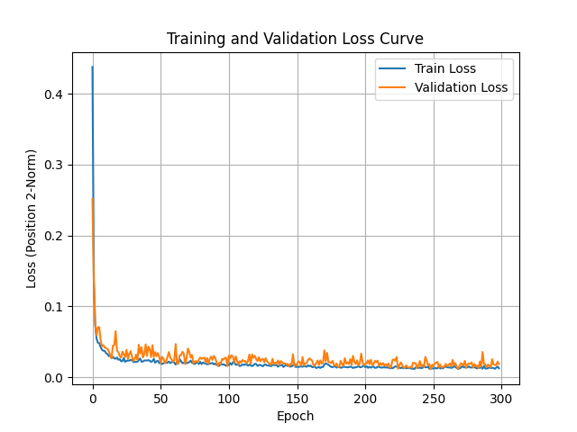
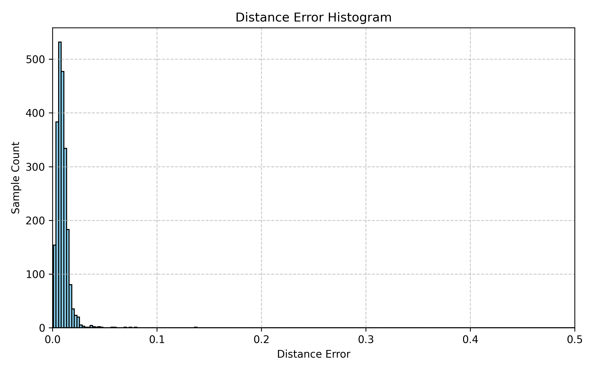
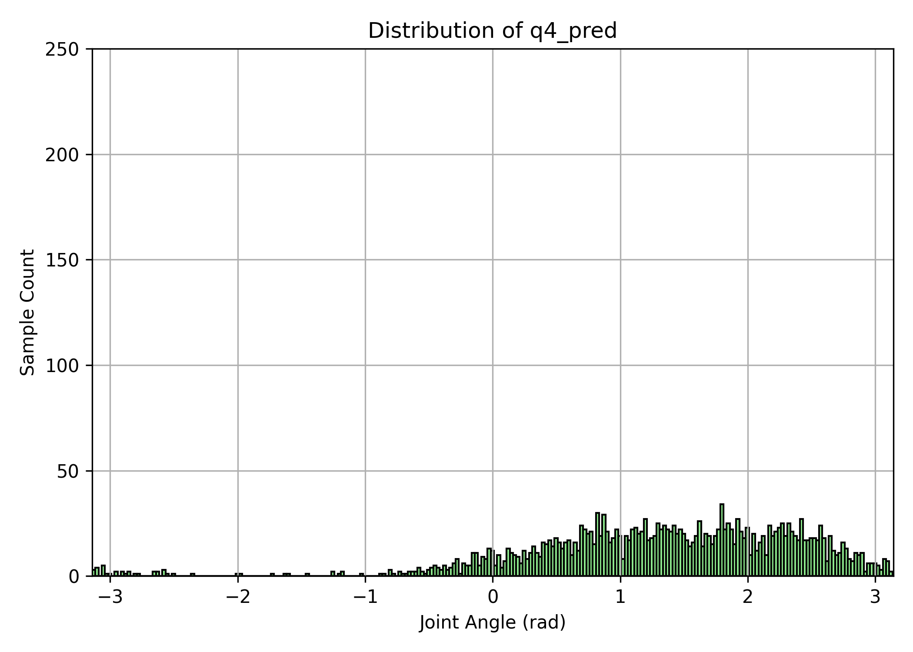
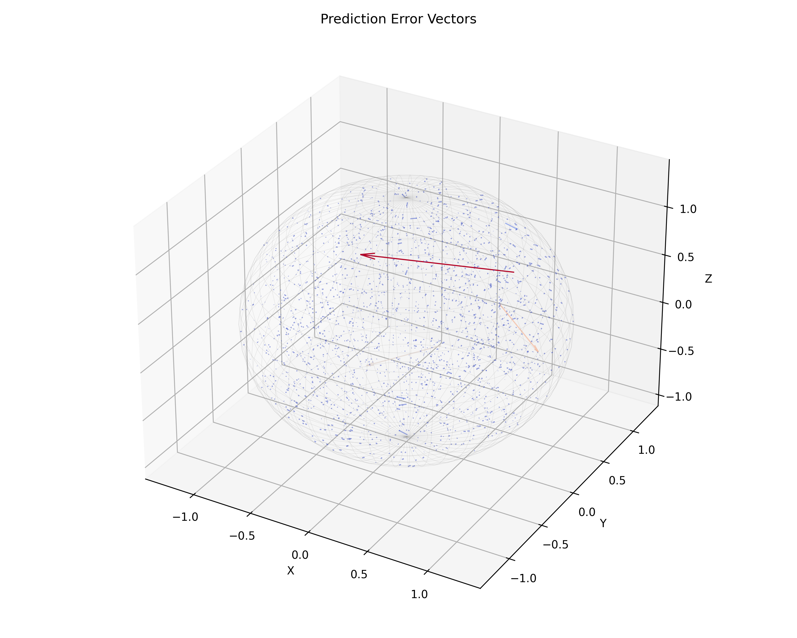

# UR10 Inverse Kinematics with Neural Networks

本專案使用深度學習 (TensorFlow/Keras) 建立 UR10 機械手臂的逆向運動學 (IK) 模型，將末端位置 (position) 映射到六個關節角度。

---

## 📦 環境建置 (Anaconda)

建議使用 **Python 3.10**，透過 Anaconda 建立虛擬環境：

### 1. 建立虛擬環境
```bash
conda create -n ur10_env python=3.10
```
### 2. 啟用虛擬環境
```bash
conda activate ur10_env
```
### 3. 安裝套件
```bash
pip install -r requirements.txt
```
### 4. 確認環境建置成功
```bash
python -c "import tensorflow as tf; print(tf.__version__)"
```

## 📂 專案結構
```
ur10-inverse-kinematics/
│
├── data/                  # 訓練/驗證/測試資料
│   ├── positions_dataset.csv
│   └── test_predictions.csv(*)
├── data_gen/              # 生成資料集程式
│   └── data_generated.py
├── models/                # 已訓練的模型
│   └── ik_model.h5(*)
├── results/ (*)           # 結果展示
├── scripts/               # 訓練與評估程式
│   ├── data_utils.py
│   ├── evaluate_ik_model.py
│   ├── model_utils.py
│   ├── plot_utils.py
│   └── train_ur10_ik.py   # 主程式
├── .gitignore
├── LICENSE
├── README.md
└── requirements.txt       # 環境建置需求

(*) 標記處為執行 train_ur10_ik.py 後會被更新覆蓋的檔案
```

---

## 🛠️ 使用方法

### 1. 生成資料
```bash
python data_gen/data_generated.py
```

### 2. 訓練+評估模型
```bash
python scripts/train_ur10_ik.py
```
模型會儲存到：
```
models/ik_model.h5
```

---

## 📊 結果展示 (results)

- Loss curve

- 距離誤差分佈

- 關節角度分佈

- 3D 視覺化結果 (距離誤差向量)


---

## 📜 License
本專案使用 MIT License，允許自由使用、修改及發佈，但不保證任何責任。
